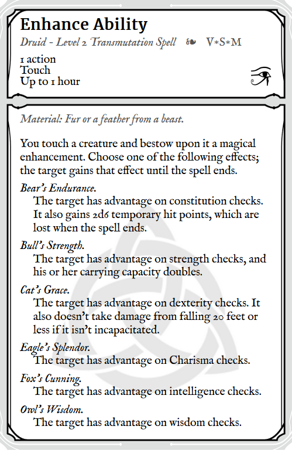
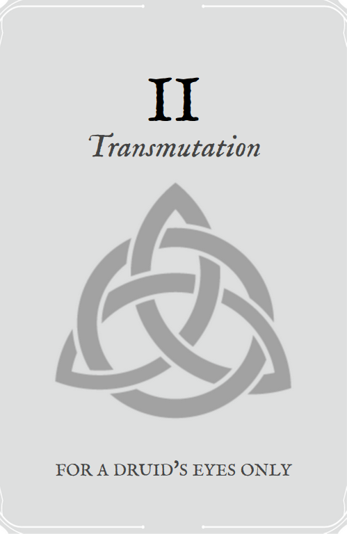

Druid spell-deck based off of pagan symbols and the official dnd 5e character sheet.

Massive thanks to the dudes who made DnD 5e API: http://www.dnd5eapi.co/

Check out the [pdf](https://github.com/dwbrite/dnd-druid-cards/blob/main/druid_deck.pdf) to see the results without needing to overload their servers :^)

